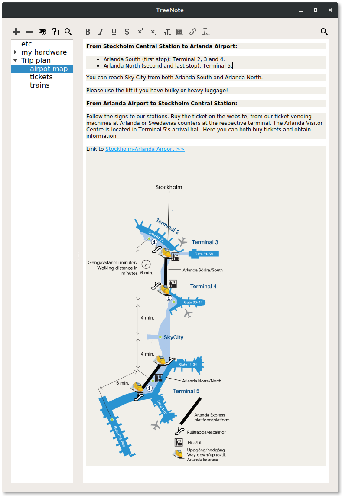

# About

NotesTree is a note taking app, which organizes notes in a hierarchical (tree like) structure.

What makes it different?

* Very simple file structure. Your notes are easily available even without NotesTree installed. They are stored as html files. Just open them in any web browser, including the one on your mobile phone.
* You can store complete web pages, simply by copy-pasting a page into a note. NotesTree automatically downloads all the images, making the note available offline.
* You can attach files of any types to your notes.

 

# Getting it

You can get the wayland only x86-64 binary at the releases section.

## DEB

Or you can run `make-deb` to build a deb package. You will need `build-essential` and `devscripts` packages installed.

## Other
 
...or build it yourself. You'll need qt6 installed.
